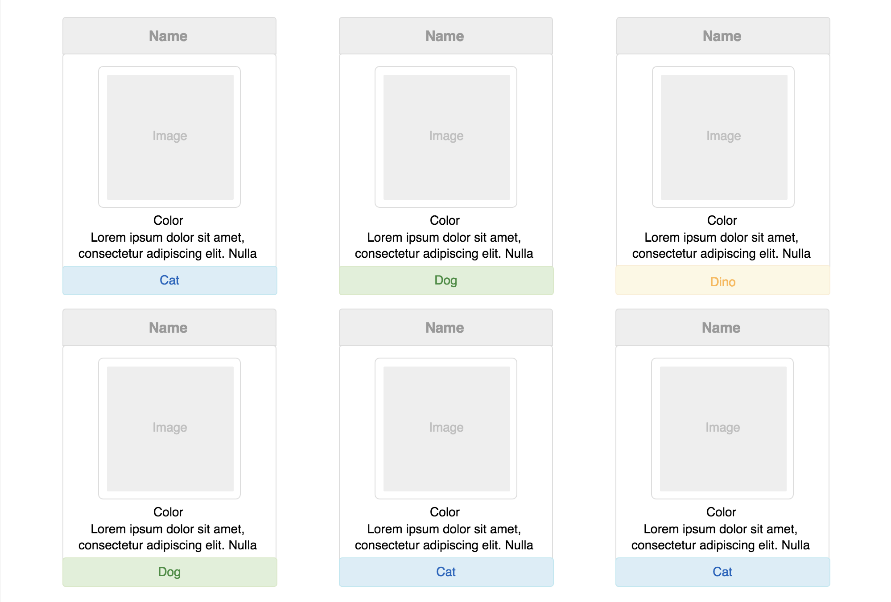
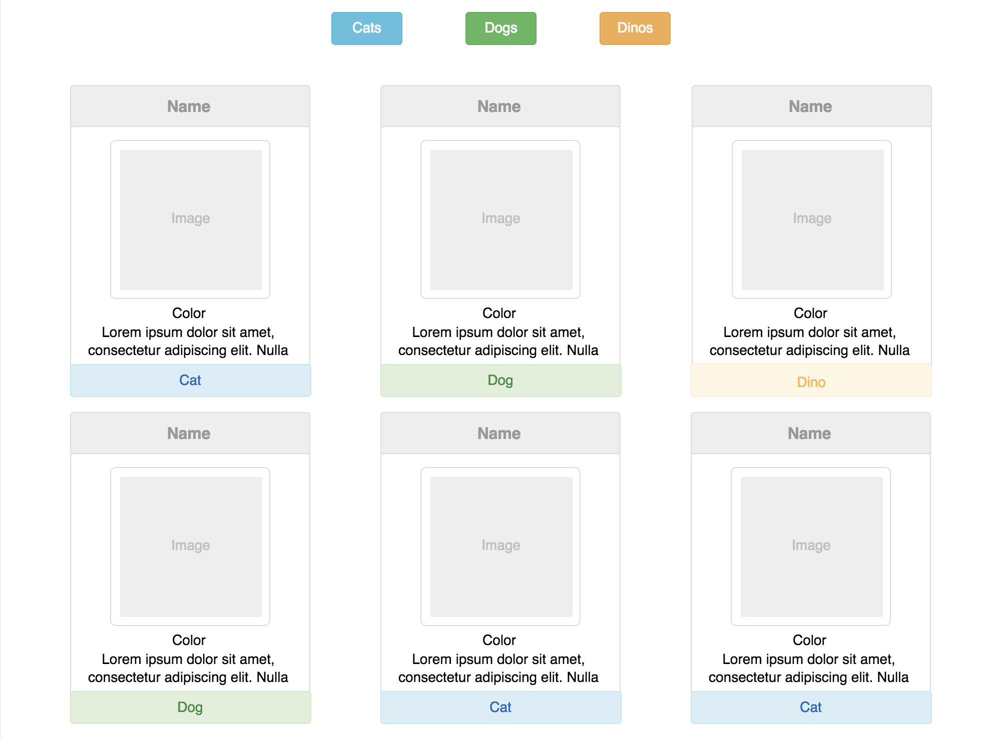

## Requirements - Part 1: Describing Data 

As a user, I want to see a listing of all available pets. Each pet should have a card that has all this data:
- id
- image
- name
- color
- specialSkill
- typeOfPet

Navigate to [dbDiagram.io](https://dbDiagram.io) and create an entity for these properties.

Once you have completed your entity, [compare with this one](https://dbdiagram.io/d/631ff2e40911f91ba594dc5a).

## Requirement - Part 2: HTML Representation of Data
- Using the data provided in `main.js`, take a look at the format and update the data if needed based on the data example above.
- Loop through each object and render each item to the DOM

## Requirement - Part 3: Event Listeners

<!-- resume here -->
- As a user, I want to see 3 category(type) buttons rendered at the top of the page. Each should be a different color. These can be hard-coded in the HTML.
- I want to be able to click one of the 3 buttons, then only the cards that are in the category(type) should show.
- There should be some way for the user to unfilter the results (ie All Pets button).

## Requirement - Part 4: Create Pets
- Create a form that allows a user to add pets with a submit button
- When the submit button is pressed, the pet is added to the array and the DOM rerenders adding the new pet on the DOM.

## Requirement - Part 5: Delete Pets
- Each card should have a delete button that when clicked removes the pet from the array and re-renders the DOM
